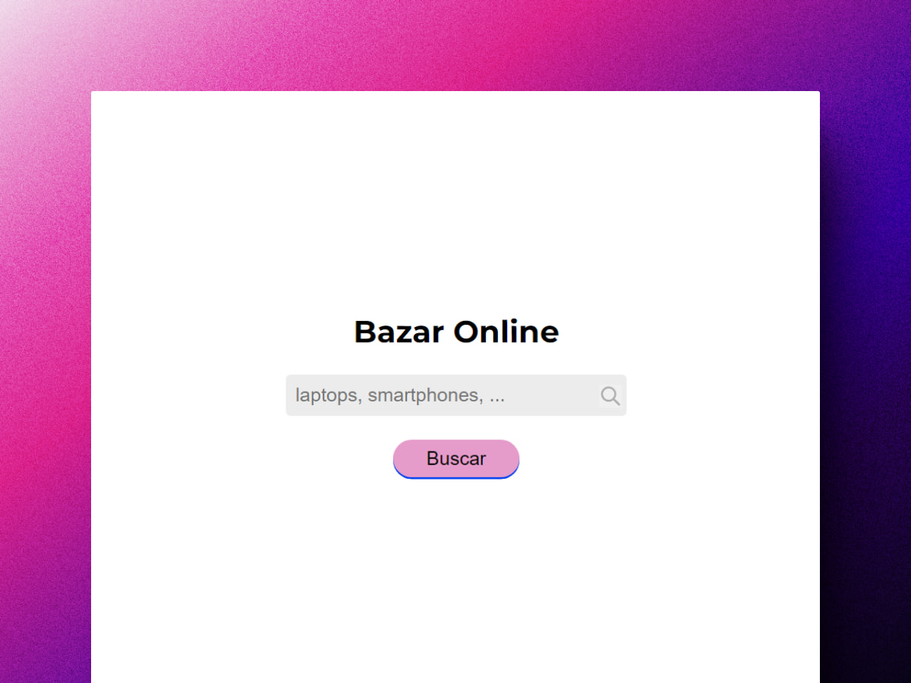
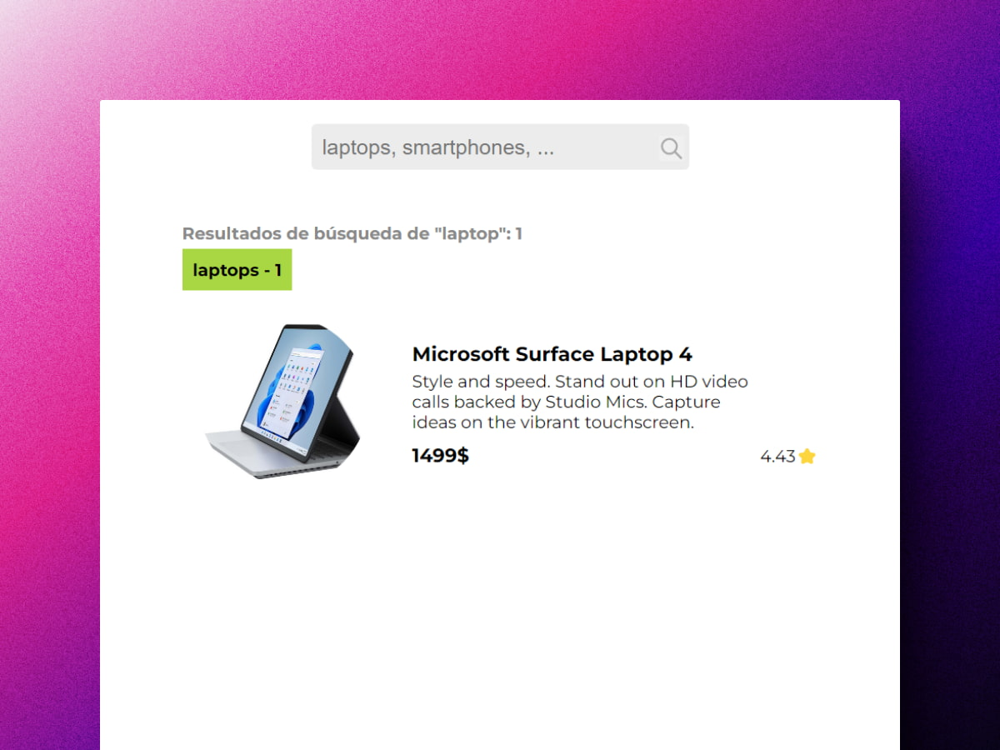
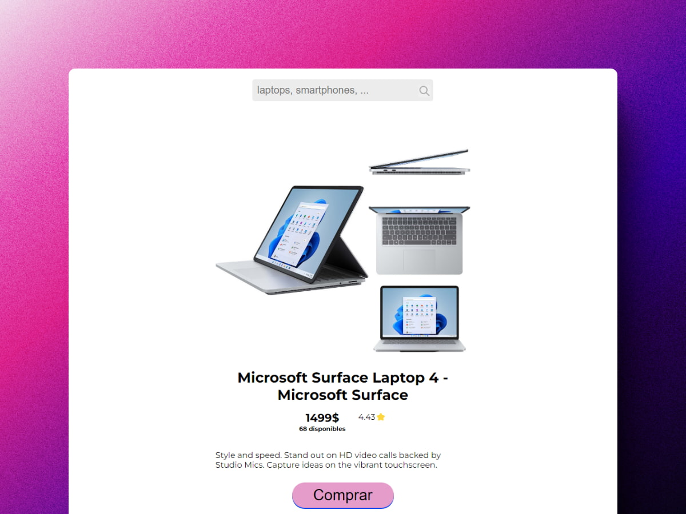
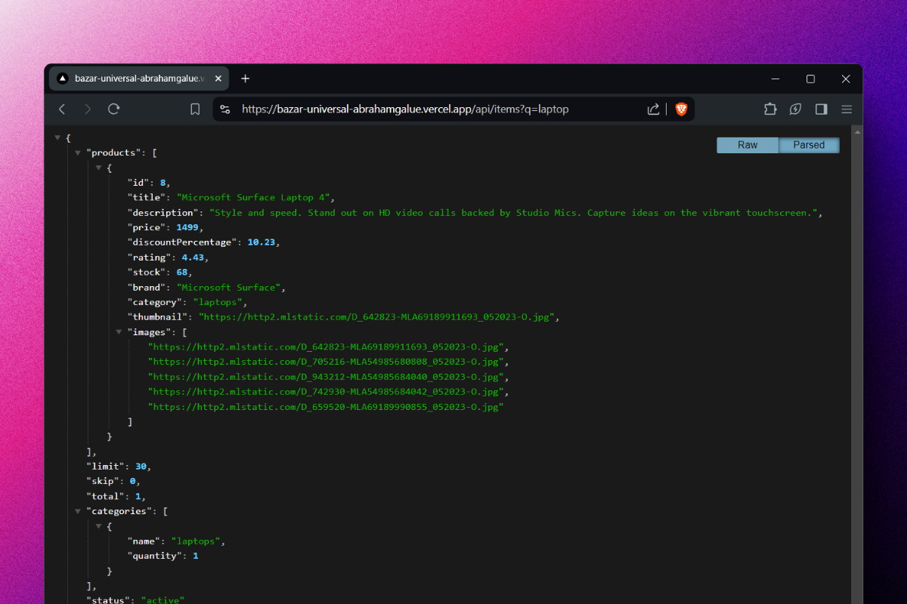
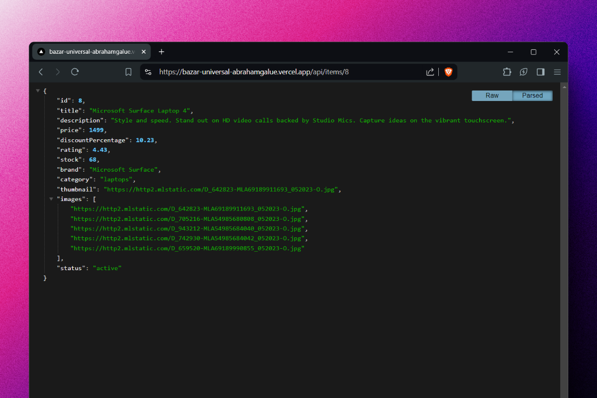
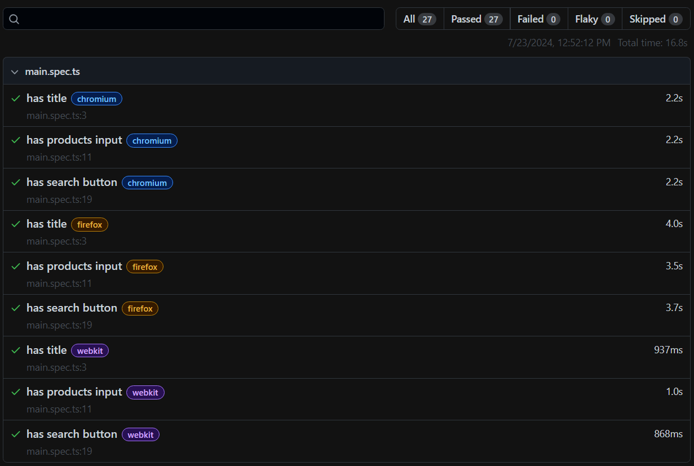
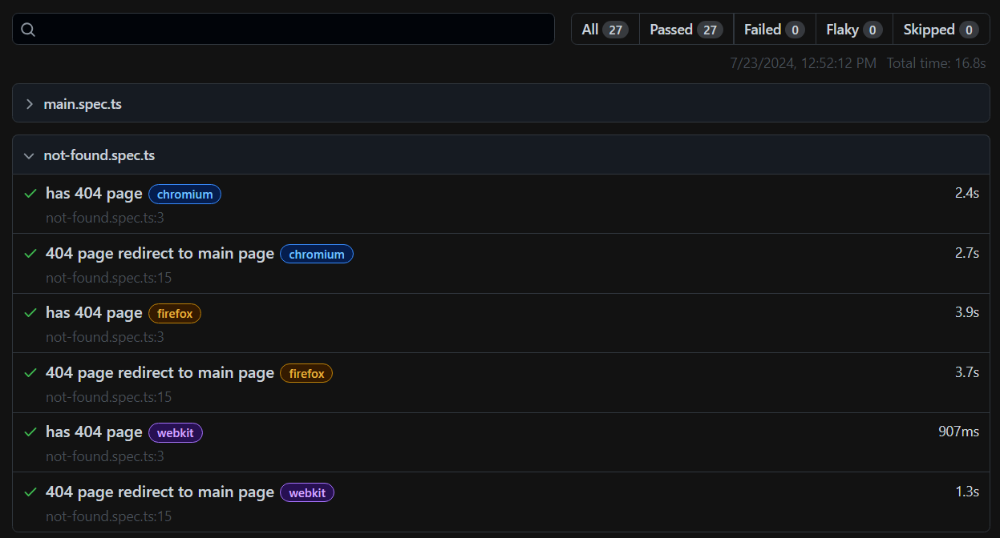
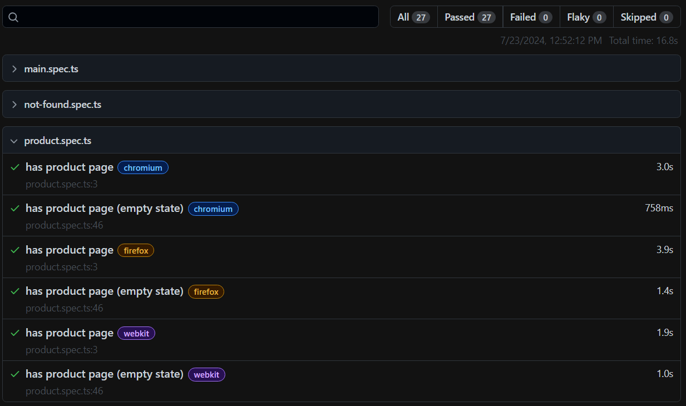
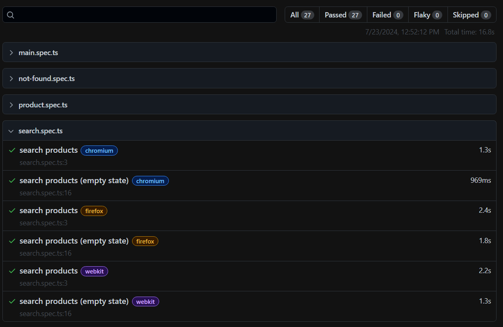

# 📖 NextJS + React + TS: Bazar Universal

### Mercado para la búsqueda de productos Full Stack

> 🧩 Aquí puedes ver su [**Live Demo.**](https://bazar-universal-abrahamgalue.vercel.app/)

## 🚀 Descripción

Este proyecto es el resultado de una **prueba técnica de Mercado Libre** que **resolví** utilizando **NextJS**.

## 🎭 Resultados de los Tests

Los tests están hechos utilizando la herramienta [**Playwright**](https://playwright.dev/).

Son pruebas **unitarias** y **end-to-end**.

Aquí debajo 👇 encontrarás la prueba técnica **real** completa.

 

# 02 - Desarrollo Full Stack de Bazar

<small>

Info:

- [¿Cómo puedo participar?](https://github.com/midudev/pruebas-tecnicas#c%C3%B3mo-participar)
- Basada en la prueba real usada en **Mercado Libre.**

</small>

Debes crear una aplicación que consta de **3 componentes principales**:

- Una caja de búsqueda
- La lista de resultados
- Descripción del detalle del producto

La aplicación debe constar de servidor y cliente. El servidor debe exponer un API RESTful y el cliente consumirlo.

## Contexto

Somos un bazar con todo tipo de productos. Queremos crear nuestra app web. Por ahora **nuestro mercado va a ser el móvil**.

Esta primera versión los usuarios podrán buscar el nombre del producto, le mostraremos una lista de productos y podrán hacer clic en cada uno para ver el detalle.

Ten en cuenta:

- No sabemos si el framework que utilicemos ahora será el definitivo, pero querremos reutilizar el máximo de código posible.

- La aplicación debe ser fácil de usar y **agradable a la vista**. No importa si copias el diseño o usas un catálogo de componentes.

- **Es MUY importante el SEO de la aplicación**. Así que el robot de Google debe poder ver bien nuestra página, navegarla sin problemas y el rendimiento debe ser el adecuado.

- Queremos también que los usuarios puedan compartir los productos en redes sociales.

## Requisitos

### Funcionalidad

1. **Crea las 3 páginas**: Inicio con caja de búsqueda, resultados de búsqueda y detalle.

2. **Las rutas de las páginas serán**:

- Home con caja de búsqueda

  - Ruta: `/`
  - Descripción: Simplemente muestra una caja de búsqueda para poder hacer la búsqueda de productos. Al realizar la búsqueda navegar a la vista de Resultados de búsqueda.

- Resultados de búsqueda:

  - Ruta: `/items?search=`, por ejemplo: `/items/?search=laptop`
  - Descripción: Muestra justo debajo de la caja de búsqueda, el número de resultados y también los resultados que muestra para cada categoría. En cada tarjeta de los resultados muestra: título, descripción, precio, categoría, imagen y puntuación.

- Detalle de producto: "/items/:id"
  - Ruta: `/items/:id`
  - Descripción: Muestra la descripción completa del producto, incluyendo todos los detalles que tengas: precio, descripción, marca, stock, categoría, etc. Muestra todas las imágenes. También un botón para poder realizar la compra (aunque no funcione)

3. **API**: Debes crear dos endpoints, debes basarte en el contenido del archivo `products.json` que tienes en este repositorio pero no tienes por qué seguir ese esquema. Los endpoints a crear son:

- `/api/items?q=:query` donde `:query` es la búsqueda que hace el usuario. Debe devolver un JSON con los datos a mostrar en la lista de items.
- `/api/items/:id`, donde `:id` es el id del producto seleccionado. Debe devolver un JSON con los datos del item seleccionado.

4. **Despliegue**: La aplicación debe estar desplegada en algún servicio de hosting gratuito (Netlify, Vercel, Firebase, etc) y debe ser accesible a través de una URL pública. **Indica la URL al hacer la Pull Request.**

5. **Test**: La aplicación debe tener AL MENOS un test. Haz el test que consideres más importante para tu aplicación.

## Consejos sobre el código

1. **Estructura del código**: El código debe estar bien organizado y fácil de leer.

2. **Semántica HTML**: El HTML debe ser semántico y accesible.

3. **Pensando en equipo**: Prepara tu proyecto pensando que cualquier persona de tu equipo puede tener que trabajar en él en el futuro. (scripts en el package.json, mínima documentación en el README, comentarios en el código si es necesario, etc)

4. **Formatea tu código**: Asegúrate de que tu código está formateado de forma consistente. Puedes usar Prettier o cualquier otra herramienta que te guste.

5. **Preparado para producción**: Asegúrate de que tu aplicación está lista para producción. Minimiza el código, optimiza las imágenes, etc.

## Desafíos adicionales

**¿Quieres ir más allá?** Estos son algunos desafíos adicionales que puedes intentar:

- Implementa la funcionalidad de carrito de la compra.
- Haz que el diseño sea responsive.
- Integra la paginación tanto en la API como en la web.
